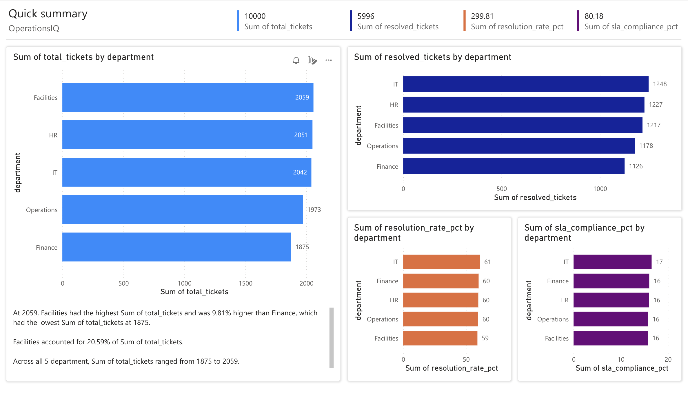

# OperationsIQ: Data Quality & Reporting Dashboard

An end-to-end operational analytics project that consolidates support ticket data from multiple internal systems, implements automated data validation workflows, and delivers a unified Power BI reporting suite for departmental stakeholders.

## Project Overview
This project simulates a real-world IT operations analytics workflow — from raw data generation to automated validation to interactive dashboard — designed to surface support volume, resolution rates, SLA compliance, and efficiency metrics.

## Tech Stack
- **Python** (Pandas, NumPy, Matplotlib, Seaborn) - data generation, validation, analysis
- **SQL** (SQLite) - querying, joining, and aggregating across multiple tables
- **Power BI** - interactive reporting suite with departmental dashboards
- **Git** - version control

## Dataset
Synthetic dataset generated to mirror real IT operations data:
- 10,000 support tickets across 5 departments
- 50 agents across Junior, Mid, and Senior seniority levels
- 7 ticket categories with priority levels (Critical, High, Medium, Low)
- SLA targets defined per priority level

## Key Features

### Automated Data Validation
Five-point validation pipeline identifying:
- Missing records (resolution days, satisfaction scores)
- Schema mismatches (invalid status and priority values)
- Duplicate ticket IDs
- Date integrity issues (resolution before open date)
- SLA compliance by priority level

### SQL Analytics
- Support volume and resolution rate by department
- Average resolution time vs SLA target by priority
- SLA compliance breakdown by department
- Ticket volume and satisfaction by category
- Monthly ticket trend with escalation tracking
- Top agent performance by satisfaction score

### Power BI Dashboard
Four-panel reporting suite surfacing:
- Support volume by department
- Resolved tickets by department
- Resolution rate by department
- SLA compliance by department

## Key Insights
- Facilities had the highest ticket volume at 2,059 tickets
- IT department had the highest resolution rate at 61.12%
- Overall SLA compliance was 16% due to aggressive targets
- Critical priority tickets had only 2.8% SLA compliance

## Dashboard

## Project Structure
OperationsIQ/
- generate_data.py       Synthetic data generation (10K tickets, 50 agents)
- analyze.py             SQL queries, validation, charts
- queries.sql            All SQL queries
- data/                  Raw CSV files and SQLite database
- outputs/               Query results, charts, and Excel report
- dashboard.png          Power BI dashboard screenshot

## How to Run
Step 1 - Generate data:
python3 generate_data.py

Step 2 - Run analysis and validation:
python3 analyze.py
